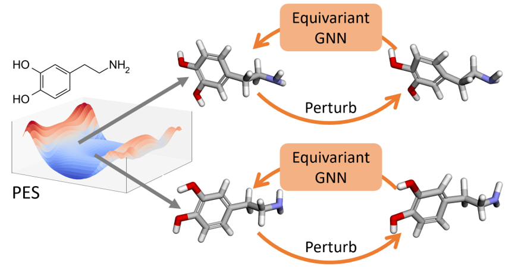

# Denoise Pre-training for ML Potentials

<strong>Denoise Pre-training on Non-equilibrium Molecules for Accurate and Transferable Neural Potentials</strong> </br>
[[arXiv]](https://arxiv.org/abs/2303.02216) [[PDF]](https://arxiv.org/pdf/2303.02216.pdf) </br>
[Yuyang Wang](https://yuyangw.github.io/), [Changwen Xu](https://changwenxu98.github.io/), [Zijie Li](https://scholar.google.com/citations?user=ji7TXTMAAAAJ&hl=en&oi=ao), [Amir Barati Farimani](https://www.meche.engineering.cmu.edu/directory/bios/barati-farimani-amir.html) </br>
Carnegie Mellon University </br>



This is the official implementation of "[Denoise Pre-training on Non-equilibrium Molecules for Accurate and Transferable Neural Potentials](https://arxiv.org/abs/2303.02216)". In this work, we propose denoise pretraining on non-equilibrium molecular conformations to achieve more accurate and transferable potential predictions with invariant and equivariant graph neural networks (GNNs). Our models pre-trained on small molecules demonstrate superior accuracy and transferability, which improves performance when fine-tuned on diverse molecular systems which include different elements, biomolecules, and larger systems. 

## Getting Started

1. [Installation](#installation)
2. [Dataset](#dataset)
4. [Pre-training](#pretrain)
5. [Fine-tuning](#finetune)
6. [Pre-trained models](#models)

### Installation <a name="installation"></a>

Set up a conda environment and clone the github repo

```
# create a new environment
$ conda create --name ml_potential python=3.8
$ conda activate ml_potential

# install requirements
$ conda install pytorch==1.12.0 cudatoolkit=11.6 -c pytorch -c conda-forge
$ conda install pyg -c pyg
$ conda install -c dglteam/label/cu116 dgl
$ conda install -c conda-forge tensorboard openmm
$ pip install PyYAML rdkit ase
$ pip install git+https://github.com/AMLab-Amsterdam/lie_learn

# clone the source code
$ git clone https://github.com/yuyangw/Denoise-Pretrain-ML-Potential.git
$ cd Denoise-Pretrain-ML-Potential
```

### Dataset <a name="dataset"></a>

The datasets used in the work are summarized in the following table, including the link to download, number of molecules, number of conformations, number of elements, number of atoms per molecule, molecule types, and whether each dataset is used for pre-training (PT) and fine-tuning (FT). GNNs are pre-trained on the combination of ANI-1 and ANI-1x, and fine-tuned on each dataset separately.

| Dataset | Link | # Mol. | # Conf. | # Ele. | # Atoms | Molecule types | Usage
| ------- | ------- | ------- | ------- | ------- | ------- | ------- | ------- |
| ANI-1   | [[link]](https://figshare.com/articles/dataset/ANI-1_data_set_20M_DFT_energies_for_non-equilibrium_small_molecules/5287732) | 57,462 | 24,687,809 | 4  | 2~26 | Small molecules | PT & FT 
| ANI-1x  | [[link]](https://figshare.com/articles/dataset/ANI-1x_Dataset_Release/10047041/1) | 63,865 | 5,496,771  | 4  | 2~63 | Small molecules | PT & FT |
| ISO17   | [[link]](http://quantum-machine.org/datasets/) | 129    | 645,000    | 3  | 19 | Isomers of C7O2H10 | FT |
| MD22    | [[link]](http://www.sgdml.org/#datasets) | 7 | 223,422 | 4 | 42~370 | Proteins, lipids, carbohydrates, nucleic acids, supramolecules | FT |
| SPICE   | [[link]](https://zenodo.org/record/7338495#.Y_aCx3bMK38) | 19,238 | 1,132,808  | 15 | 3~50 | Small molecules, dimers, dipeptides, solvated amino acids | FT |

### Pre-training <a name="pretrain"></a>

To pre-train the invariant or equivariant GNNs, where the configurations and detailed explaination for each variable can be found in `config_pretrain.yaml`
```
$ python pretrain.py
```

To monitor the training via tensorboard, run `tensorboard --logdir {PATH}` and click the URL http://127.0.0.1:6006/.

### Fine-tuning  <a name="finetune"></a>

To fine-tune the pre-trained GNN models on molecular potential predictions, where the configurations and detailed explaination for each variable can be found in `config.yaml`
```
$ python train.py
```

### Pre-trained models <a name="models"></a>

We also provide pre-trained checkpoint `model.pth` and the configuration `config_pretrain.yaml` for each model, which can be found in the `ckpt` folder. Pre-trained models include: 
- Pre-trained SchNet in `ckpt/schnet` folder
- Pre-trained SE(3)-Transformer in `ckpt/se3transformer` folder
- Pre-trained EGNN in `ckpt/egnn` folder
- Pre-trained TorchMD-Net in `ckpt/torchmdnet` folder

## Reference

If you find our work useful in your research, please cite:
```
@article{wang2023denoise,
  title={Denoise Pre-training on Non-equilibrium Molecules for Accurate and Transferable Neural Potentials},
  author={Wang, Yuyang and Xu, Changwen and Li, Zijie and Barati Farimani, Amir},
  journal={arXiv preprint arXiv:2303.02216},
  year={2023}
}
```

## Acknowledgement

The implementation of GNNs in this work is based on:
- Implementation of SchNet: [kyonofx/MDsim](https://github.com/kyonofx/MDsim/blob/main/mdsim/models/schnet.py) \& [PyG](https://pytorch-geometric.readthedocs.io/en/latest/generated/torch_geometric.nn.models.SchNet.html)
- Implementation of SE(3)-Transformer: [FabianFuchsML/se3-transformer-public](https://github.com/FabianFuchsML/se3-transformer-public)
- Implementation of EGNN: [vgsatorras/egnn](https://github.com/vgsatorras/egnn)
- Implementation of TorchMD-Net: [torchmd/torchmd-net](https://github.com/torchmd/torchmd-net)